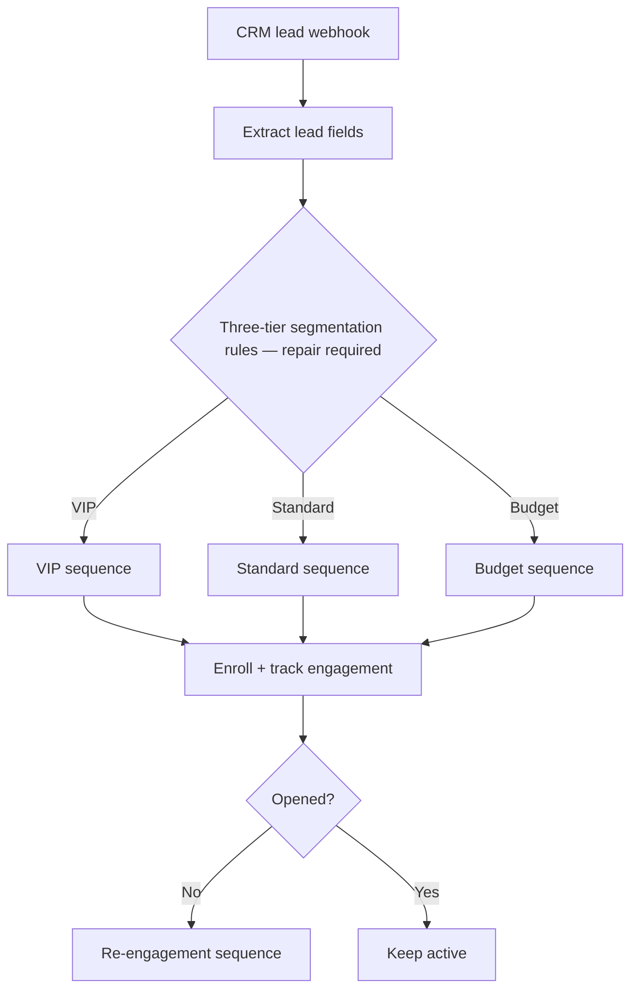

# Email Segmentation & Re-engagement Automation

> **Status: Template under repair — 3-tier branching is not currently valid.** See [TEMPLATE_STATUS.md](TEMPLATE_STATUS.md).

A portfolio n8n template intended to segment new leads into VIP / Standard / Budget email sequences and move cold subscribers into re-engagement. The current export contains useful structure, but its segmentation node is an n8n **IF** node wired to three outputs. An IF node only provides two outputs, and the source material defines a concrete VIP condition but does **not** define authoritative Standard-vs-Budget criteria.

The repository therefore must not be described as a verified working three-tier automation until those business rules are supplied and the branch is rebuilt with a valid Switch/routing structure.

## Intended flow



## What the current export proves

- webhook intake for `company_size`, `budget`, `industry`, `email`, and `name`;
- a concrete VIP condition based on company size, budget, and SaaS industry;
- VIP / Standard / Budget Set nodes with intended send frequencies;
- sequence-enrollment and analytics request nodes;
- a re-engagement check and active/re-engagement paths;
- placeholder-only external API configuration.

## Current blocking defect

The `Segment Lead` node is `n8n-nodes-base.if` but the connection map defines **three main outputs**. That is not a valid three-way routing model.

The archive does not provide enough evidence to invent the missing Standard-vs-Budget thresholds. A safe repair therefore requires the business owner to define those two tiers, then replace the IF node with a valid Switch or equivalent deterministic router.

## Repair acceptance criteria

1. Define mutually exclusive VIP / Standard / Budget criteria.
2. Use a valid n8n Switch or deterministic routing structure.
3. Ensure exactly one tier is selected for each valid lead.
4. Define behavior for missing/invalid `company_size`, `budget`, or `industry`.
5. Run at least one fixture for each tier plus malformed input.
6. Verify each tier reaches the correct enrollment payload/frequency.
7. Verify re-engagement behavior separately.
8. Record actual results; do not infer a pass from importability.

## Demo status

No configured live-run recording is included. Credentials, provider endpoints, and tier-completion rules remain configuration/repair work.

## Setup

Do **not** activate the workflow as-is.

1. Read [TEMPLATE_STATUS.md](TEMPLATE_STATUS.md).
2. Define the missing Standard/Budget business rules.
3. Repair the routing node.
4. Replace placeholder provider URLs/credentials.
5. Import into a clean current n8n instance.
6. Execute the required tier and failure fixtures before use.

## Repository structure

```text
.
├── index.html
├── README.md
├── TEMPLATE_STATUS.md
├── LICENSE
├── .gitignore
└── workflow/
    └── T30_Email_Segmentation_Automation.json
```

## Evidence boundary

This is an engineering/template asset under repair, not a configured production segmentation system and not evidence of email-performance or business results.

---

Designed and engineered by **Oyekola Ololade**  
AI Systems & Integration Engineer
